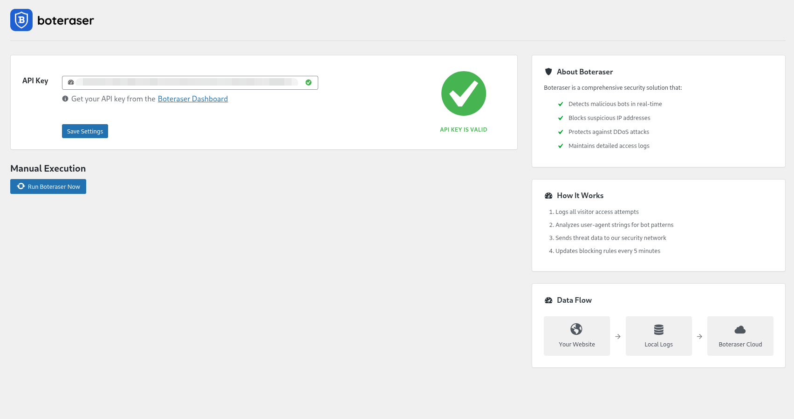
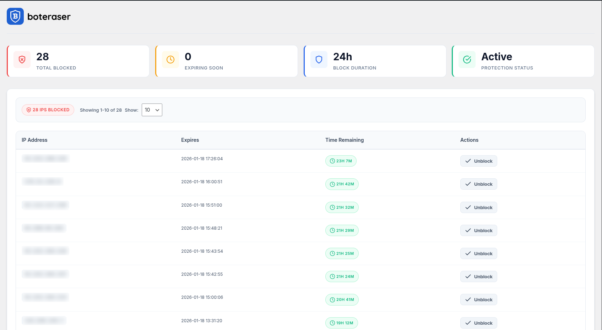
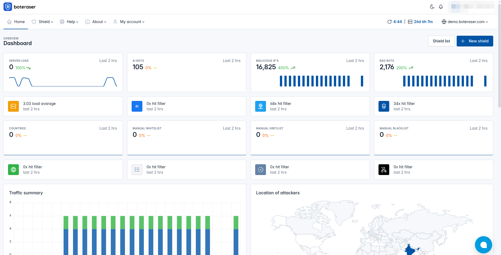
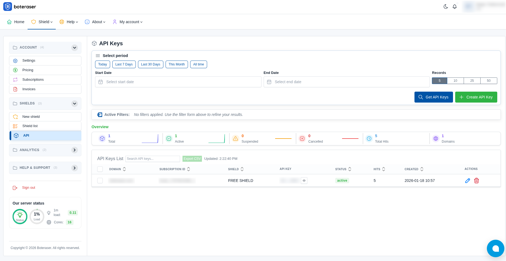
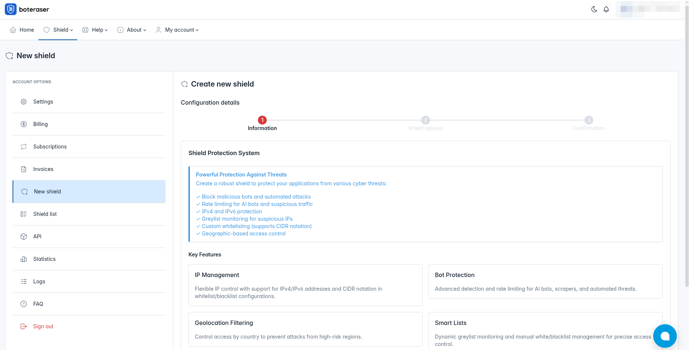

# Boteraser - Block Bots & Secure Your Website

Bot protection solution with flexible deployment options.

## Installation Options

Choose the method that best suits your needs:

### 1. **Automated Server Install (Recommended)**
📁 [`be-client-install-script/README.md`](be-client-install-script/README.md)

One-command automated setup for VPS or dedicated servers. Handles dependencies and configuration automatically.

### 2. **Manual Server Install**
📁 [`be-client/README.md`](be-client/README.md)

Full control manual installation for VPS or dedicated servers. Choose this if you need step-by-step customization.

### 3. **WordPress Plugin**
📁 [`wordpress-plugin/README.md`](wordpress-plugin/README.md)

Easy WordPress integration. Install directly through your WordPress admin panel without managing a server.

---

Each folder contains a detailed README.md with prerequisites, installation steps, and configuration instructions.

## Screenshots

Use the WordPress plugin or the server script to block malicious traffic, bad bots, and automated attacks. Install the script with the automated installer or set it up manually—both deliver the same protection.

### Dashboard Overview
This is the WordPress plugin dashboard showing API status and site-wide statistics. After configuring the API in the plugin settings, run a manual check to verify connectivity and view updated metrics immediately.

### Blocked IPs
WordPress plugin: Blocked IPs show IP + reason, auto-release time, and an Unblock button. Unblocked IPs may be re-blocked.

### Main Dashboard (Stats)
Single view of real-time protection metrics, traffic trends, recent activity, and quick actions with basic filters and alerts.

### User API
Shows base URL, API key visibility/rotation, request usage, rate limits, and last verification status. Use the verify/test action to confirm connectivity, and regenerate to rotate credentials. Keep the key secret and update clients after rotation.

### User SHIELD
Create and manage security shields with configurable rules and quick enable/disable controls.

### Script BLOCKING IPS
This script blocks specified IPv4 and IPv6 addresses or CIDR ranges by adding idempotent deny or drop rules to mitigate abusive traffic.

### Script CONFIG
Central configuration for the blocking script, specifying API credentials and path to you log file.

