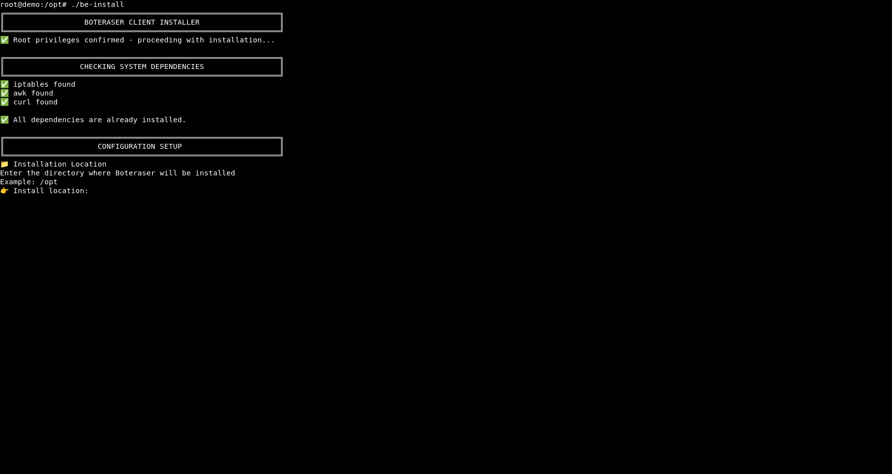

# BE Client Install Script (Recommended)

Short description: Automated installer that sets up the BE Client on your VPS or dedicated server with minimal interaction.

## Why this
- One-command style setup
- Handles common dependencies and system wiring for you
- Best option if you don’t need step-by-step manual control

Manual install alternative: ../be-client/README.md

## Prerequisites
- Linux server (VPS or Dedicated)
- Shell access (bash) with sudo/root privileges
- tar installed (to extract the archive)

## Quick start
1. Copy the installer archive to your server and extract it:

```bash
cd /path/where/you/placed/the/archive
ls -lh be-client-install-script.tar.gz
sudo tar -xzf be-client-install-script.tar.gz
cd be-client-install-script*/
```

2. Run the installer script:

```bash
chmod +x be-install
sudo ./be-install
```

3. Follow the prompts. The script will:
- Install required components (as needed)
- Configure and start the BE Client
- Print where to check status/logs

## Cron scheduling (every 5 minutes)
Run every 5 minutes via cron:

Without logging:
```bash
*/5 * * * * /absolute/path/to/your/be-client >/dev/null 2>&1
```

With logging:
```bash
*/5 * * * * /absolute/path/to/your/be-client >>/var/log/be-client.log 2>&1
```

Use absolute paths; create `/var/log/` directory if missing.

## Next steps
- Verify the service status (the installer will indicate how)
- Keep the script folder for re-runs or reference
- For advanced/fully manual control, see: ../be-client/README.md

## Screenshots

Install the script with the automated installer or set it up manually—both deliver the same protection. Below is example screenshot showing the BE Client installation process:

### Automated Installer in Action
The `be-install` script guides you through the setup, installing dependencies and configuring the BE Client to block abusive traffic automatically.




