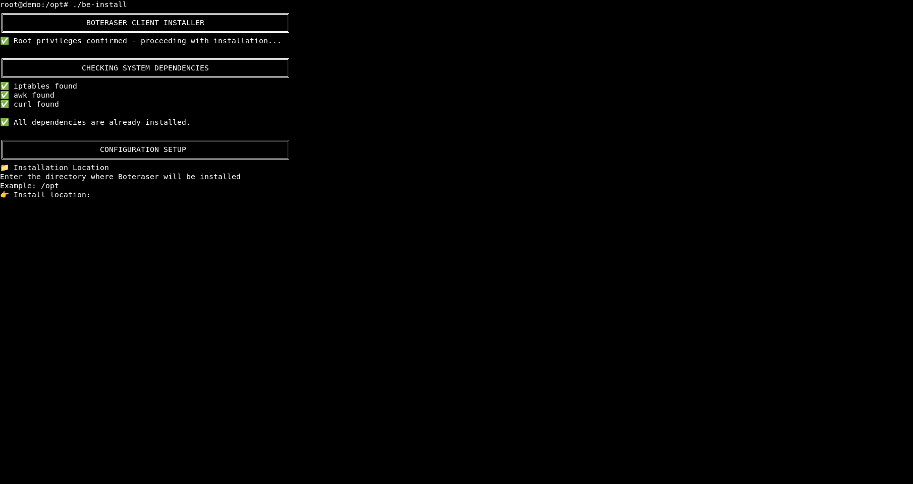

# BE Client Install Script (Recommended)

Short description: Automated installer that sets up the BE Client on your VPS or dedicated server with minimal interaction.

## Disclaimer
DISCLAIMER: This is powerful security software that runs with elevated privileges and modifies your system. It is provided "AS-IS" and "AS-AVAILABLE" without warranty of any kind, express or implied, including but not limited to the warranties of merchantability, fitness for a particular purpose, or non-infringement. Your use of the software is at your own risk. By downloading, installing or using this software, you agree to our [Terms of Service](https://boteraser.com/terms-of-service/) and [Privacy Policy](https://boteraser.com/privacy-policy/).

## Why this
- One-command style setup
- Handles common dependencies and system wiring for you
- Best option if you don’t need step-by-step manual control

Manual install alternative: ../be-client/README.md

## Prerequisites
- Linux server (VPS or Dedicated)
- Shell access (bash) with root privileges

## Quick start
1. Run the one-line installer:

```bash
curl -fsSL https://github.com/sofset-dev/boteraser/raw/refs/heads/main/be-client-install-script/be-install.sh | sudo bash
```

2. Follow the prompts. The script will:
- Install required components (as needed)
- Configure and start the BE Client
- Print where to check status/logs

## Next steps
- Verify the service status (the installer will indicate how)
- Keep the script folder for re-runs or reference
- For advanced/fully manual control, see: ../be-client/README.md

## Screenshots

Install the script with the automated installer or set it up manually—both provide the same blocking functionality. Below is example screenshot showing the BE Client installation process:

### Automated Installer in Action
The `be-install` script guides you through the setup, installing dependencies and configuring the BE Client to detect and block abusive traffic automatically.



