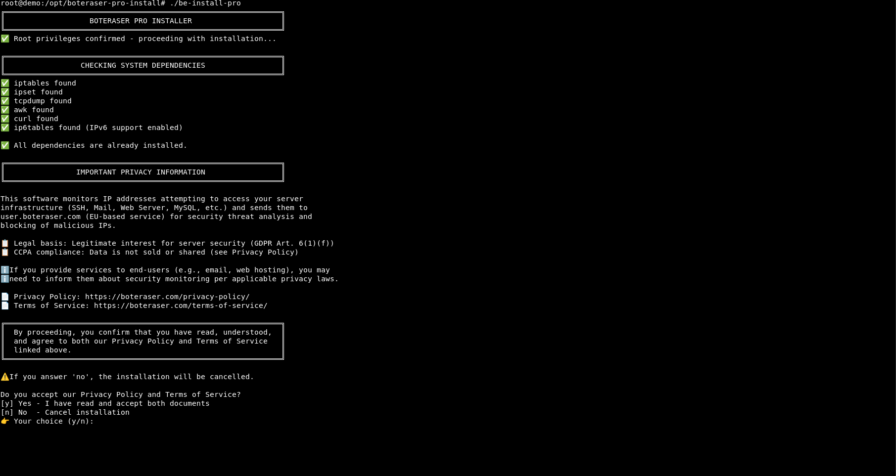

# BE Client PRO Install Script (Recommended)

Short description: Automated installer that sets up the BE Client PRO on your VPS or dedicated server with minimal interaction. Provides full server protection across all services.

## Why this
- One-command style setup
- Handles common dependencies and system wiring for you
- Best option if you don't need step-by-step manual control
- Protects your entire server, not just web traffic

Manual install alternative: ../be-client-pro/README.md

## Prerequisites
- Linux server (VPS or Dedicated)
- Shell access (bash) with sudo/root privileges
- tar installed (to extract the archive)

## Quick start
1. Copy the installer archive to your server and extract it:

```bash
cd /path/where/you/placed/the/archive
ls -lh be-client-pro-install-script.tar.gz
sudo tar -xzf be-client-pro-install-script.tar.gz
cd be-client-pro-install-script*/
```

2. Run the installer script:

```bash
chmod +x be-install-pro
sudo ./be-install-pro
```

3. Follow the prompts. The script will:
- Install required components (iptables, ipset, tcpdump, curl, awk)
- Configure network interface monitoring
- Set up the BE Client PRO
- Print where to check status/logs

## Configuration options

During installation, you'll be asked for:

| Option | Description | Example |
|--------|-------------|---------|
| Install location | Directory where BE Client PRO will be installed | `/opt` |
| API Key | Your Boteraser PRO API key from user dashboard | `xxxxxxxx-xxxx-xxxx-xxxx-xxxxxxxxxxxx` |
| Network Interface | Interface to monitor (`any` for all interfaces) | `any`, `eth0`, `ens3` |

## Cron scheduling (every 5 minutes)
Run every 5 minutes via cron:

Without logging:
```bash
*/5 * * * * cd /opt/boteraser-pro && ./be-client-pro >/dev/null 2>&1
```

With logging:
```bash
*/5 * * * * cd /opt/boteraser-pro && ./be-client-pro >>/var/log/be-client-pro.log 2>&1
```

Use absolute paths; create `/var/log/` directory if missing.

## PRO Features

| Feature | Description |
|---------|-------------|
| 🛡️ Full Server Protection | Protects all services, not just web traffic |
| 🔍 Real-time Traffic Analysis | Network packet capture via tcpdump |
| 🌐 Dual-stack Support | IPv4 and IPv6 protection |
| ⚡ High-performance Blocking | ipset-based firewall rules |
| ⏱️ Auto-expiring Blocks | 24-hour timeout on blocked IPs |

## Standard vs PRO

| Feature | Standard | PRO |
|---------|----------|-----|
| Web traffic protection | ✅ | ✅ |
| Full server protection | ❌ | ✅ |
| Requires access.log | ✅ | ❌ |
| Network-level monitoring | ❌ | ✅ |
| IPv6 support | ❌ | ✅ |
| All services protected | ❌ | ✅ |

## Next steps
- Verify the service status (the installer will indicate how)
- Keep the script folder for re-runs or reference
- For advanced/fully manual control, see: ../be-client-pro/README.md

## Useful commands

Check blocked IPv4 addresses:
```bash
ipset list boteraser-pro-v4
```

Check blocked IPv6 addresses:
```bash
ipset list boteraser-pro-v6
```

Clear all IPv4 blocks:
```bash
ipset flush boteraser-pro-v4
```

Clear all IPv6 blocks:
```bash
ipset flush boteraser-pro-v6
```

## Screenshots

Install the script with the automated installer or set it up manually—both deliver the same protection. Below is example screenshot showing the BE Client PRO installation process:

### Automated Installer in Action
The `be-install-pro` script guides you through the setup, installing dependencies and configuring the BE Client PRO to protect your entire server automatically.


