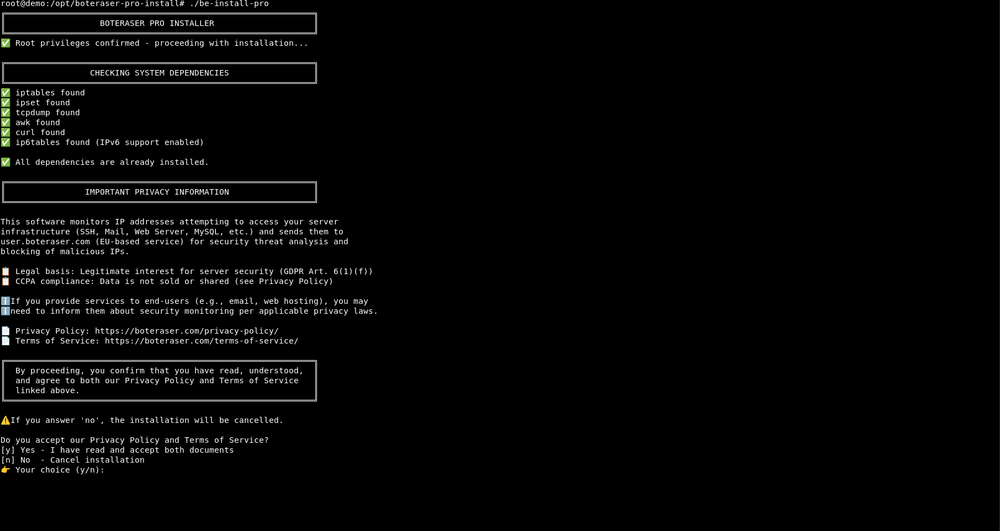

# BE Client PRO Install Script (Recommended)

Short description: Automated installer that sets up the BE Client PRO on your VPS or dedicated server with minimal interaction. Monitors network traffic and blocks suspicious IPs across all network services.

## Disclaimer
DISCLAIMER: This is powerful security software that runs with elevated privileges and modifies your system. It is provided "AS-IS" and "AS-AVAILABLE" without warranty of any kind, express or implied, including but not limited to the warranties of merchantability, fitness for a particular purpose, or non-infringement. Your use of the software is at your own risk. By downloading, installing or using this software, you agree to our [Terms of Service](https://boteraser.com/terms-of-service/) and [Privacy Policy](https://boteraser.com/privacy-policy/).

## Why this
- One-command style setup
- Handles common dependencies and system wiring for you
- Best option if you don't need step-by-step manual control
- Monitors your entire server, not just web traffic

Manual install alternative: ../be-client-pro/README.md

## Prerequisites
- Linux server (VPS or Dedicated)
- Shell access (bash) with sudo/root privileges
- tar installed (to extract the archive)

## Quick start
1. Run the one-line installer:

```bash
curl -fsSL https://github.com/sofset-dev/boteraser/raw/refs/heads/main/be-client-pro-install-script/be-install-pro.sh | sudo bash
```

2. Follow the prompts. The script will:
- Install required components (iptables, ipset)
- Configure network interface monitoring
- Set up the BE Client PRO as a systemd service
- Print where to check status/logs

## Configuration options

During installation, you'll be asked for:

| Option | Description | Example |
|--------|-------------|---------|
| Install location | Directory where BE Client PRO will be installed | `/opt` |
| API Key | Your Boteraser PRO API key from user dashboard | `xxxxxxxx-xxxx-xxxx-xxxx-xxxxxxxxxxxx` |
| Network Interface | Interface to monitor (`auto` for all interfaces) | `auto`, `eth0`, `ens3` |

## PRO Features

| Feature | Description |
|---------|-------------|
| 🛡️ Server-wide Monitoring | Monitors and blocks threats across all services, not just web traffic |
| 🔍 Real-time Traffic Analysis | Network packet capture via tcpdump |
| 🌐 Dual-stack Support | IPv4 and IPv6 blocking capabilities |
| ⚡ High-performance Blocking | ipset-based firewall rules |
| ⏱️ Auto-expiring Blocks | 24-hour timeout on blocked IPs |

## Standard vs PRO

| Feature | Standard | PRO |
|---------|----------|-----|
| Web traffic protection | ✅ | ✅ |
| Server-wide monitoring | ❌ | ✅ |
| Requires access.log | ✅ | ❌ |
| Network-level monitoring | ❌ | ✅ |
| IPv6 support | ✅ | ✅ |
| All services monitored | ❌ | ✅ |

## Next steps
- Verify the service status (the installer will indicate how)
- Keep the script folder for re-runs or reference
- For advanced/fully manual control, see: ../be-client-pro/README.md

## Useful commands

Check blocked IPv4 addresses:
```bash
ipset list boteraser-pro-v4
```

Check blocked IPv6 addresses:
```bash
ipset list boteraser-pro-v6
```

Clear all IPv4 blocks:
```bash
ipset flush boteraser-pro-v4
```

Clear all IPv6 blocks:
```bash
ipset flush boteraser-pro-v6
```

## Screenshots

Install the script with the automated installer or set it up manually—both provide the same monitoring capabilities. Below is example screenshot showing the BE Client PRO installation process:

### Automated Installer in Action
The `be-install-pro` script guides you through the setup, installing dependencies and configuring the BE Client PRO to monitor your entire server automatically.


