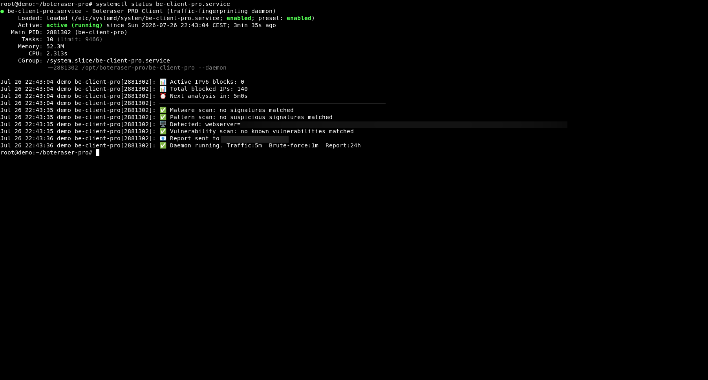
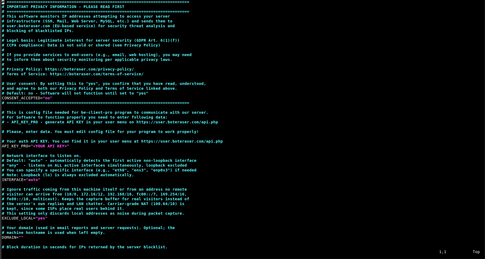

# BE Client PRO (Manual VPS/Dedicated Install)

Short description: Advanced network-level threat detection client that monitors **all network traffic** in real-time. Unlike the standard BE Client which analyzes web server logs, BE Client PRO captures and analyzes live network packets across every service on your server.

## Disclaimer
DISCLAIMER: This is powerful security software that runs with elevated privileges and modifies your system. It is provided "AS-IS" and "AS-AVAILABLE" without warranty of any kind, express or implied, including but not limited to the warranties of merchantability, fitness for a particular purpose, or non-infringement. Your use of the software is at your own risk. By downloading, installing or using this software, you agree to our [Terms of Service](https://boteraser.com/terms-of-service/) and [Privacy Policy](https://boteraser.com/privacy-policy/).

## 🛡️ Comprehensive Server Monitoring

BE Client PRO operates at the **network layer**, monitoring ALL protocols and services:

- **HTTP/HTTPS** (ports 80, 443) — Web applications, APIs, CDN
- **SSH** (port 22) — Brute-force login monitoring, repeated failed access attempts
- **FTP/SFTP** (ports 21, 22) — File transfer security monitoring
- **MySQL/MariaDB** (port 3306) — Database access pattern monitoring
- **PostgreSQL** (port 5432) — Database traffic pattern monitoring
- **MongoDB** (port 27017) — NoSQL traffic monitoring
- **Redis** (port 6379) — Cache server traffic monitoring
- **SMTP/IMAP/POP3** (ports 25, 465, 587, 993, 995) — Email server traffic monitoring
- **DNS** (port 53) — DNS amplification pattern monitoring
- **VPN/OpenVPN** (port 1194) — VPN server traffic monitoring
- **Docker API** (ports 2375, 2376) — Container security monitoring
- **Kubernetes** (ports 6443, 10250) — K8s cluster traffic monitoring
- **Game Servers** (Minecraft 25565, etc.) — DDoS / high-volume traffic pattern monitoring
- **ANY TCP/UDP service** — Full-spectrum network monitoring

## When to use
- You need monitoring across **all services**, not just web traffic
- You want real-time network traffic analysis
- Your server runs SSH, databases, mail servers, or other non-HTTP services
- You prefer manual installation with full control

## Prerequisites
- Linux server (VPS or Dedicated)
- Shell access (bash) with sudo/root privileges
- iptables installed
- ipset installed
- systemd

## Quick start

1. Download be-client-pro-latest.tar.gz to your preferred location (recommended: /opt):

```bash
cd /opt
wget https://github.com/sofset-dev/boteraser/raw/refs/heads/main/be-client-pro/be-client-pro-latest.tar.gz
```

2. Extract the archive and enter the directory:

```bash
tar -xzvf be-client-pro-latest.tar.gz
cd boteraser-pro
```

3. Edit the configuration file. Open be-pro.conf with a text editor:

```bash
nano be-pro.conf
```
or
```bash
vi be-pro.conf
```

In be-pro.conf, set the following:

- `CONSENT_ACCEPTED="yes"` – **required**. By setting this you confirm that you have read, understood and agree to the Privacy Policy and Terms of Service, and that — where applicable law requires it — you will disclose this security monitoring to your own end-users. The software will not start until this is set to `"yes"`.
- `API_KEY_PRO` – your PRO API key. You can generate it at: https://user.boteraser.com/api.php
- `INTERFACE` – set to `"auto"` to use the first detected interface, `"any"` for all interfaces except loopback, or specify one directly (e.g., `eth0`).

Example:

```
CONSENT_ACCEPTED="yes"
API_KEY_PRO="<YOUR API KEY>"
INTERFACE="auto"
```

Optionally configure the email report (`SMTP_HOST`, `SMTP_USER`, `SMTP_PASS`, `NOTIFY_EMAIL`) and the brute-force, malware and vulnerability options — every setting is documented in the comments inside be-pro.conf. Save and exit.

4. Install the bundled systemd service file (it is included in the package and already contains the correct settings):

```bash
cp be-client-pro.service /etc/systemd/system/
```

If you extracted the files somewhere other than /opt/boteraser-pro, edit the `WorkingDirectory` and `ExecStart` paths in /etc/systemd/system/be-client-pro.service to match your location. Then reload systemd:

```bash
systemctl daemon-reload
```

5. Enable and start the service (it will also start automatically on boot):

```bash
systemctl enable --now be-client-pro
```

6. Check the service status and view logs:

```bash
systemctl status be-client-pro
journalctl -u be-client-pro -f
```

✅ That's it! BE Client PRO now runs continuously as a background daemon, monitoring your server's network traffic and automatically blocking unwanted IPs at the firewall level.

## Notes
- BE Client PRO requires a PRO subscription
- Runs as a single daemon process — continuously sniffs live network traffic in real time
- Keeps a rolling ring buffer of the last 10000 captured packets and runs an analysis pass every 5 minutes (evaluating the last 5 minutes of traffic)
- Derives JA4 / JA4H / JA4T fingerprints per source IP and enforces the server threat lists (including the PRO-only JA4 fingerprint list)
- Includes SSH brute-force protection, file signature scanning (with quarantine), vulnerability scanning, and scheduled email reports
- Blocked IPs from the server blocklist auto-expire after 24 hours by default (`BLOCK_TIMEOUT`); brute-force blocks use their own duration (`BF_BLOCK`)
- Supports both IPv4 and IPv6 (dual-stack)
- Uses ipset + iptables for high-performance O(1) blocking, with firewall state persisted across reboots
- For web-only monitoring with bot name detection, use standard BE Client

## Screenshots

BE Client PRO provides comprehensive network-level monitoring. Below are example screenshots:

### Script Execution
Real-time network traffic capture, analysis, and IP blocking in action.



### Configuration File
Simple configuration with API key and network interface settings.


