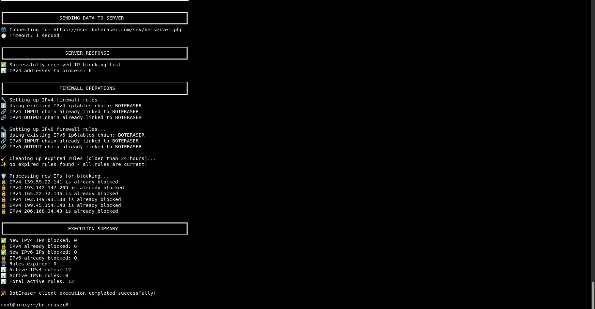
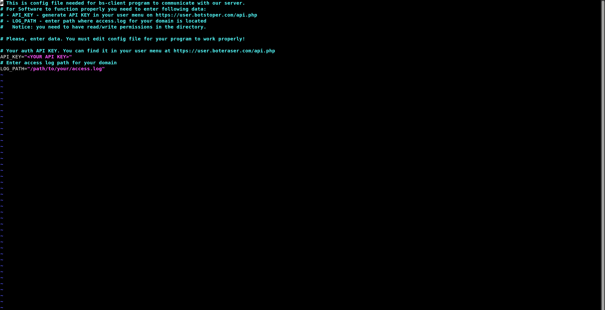

# BE Client (Manual VPS/Dedicated Install)

Short description: Self-hosted backend client to run on your own VPS or dedicated server. Choose this if you prefer full control and a manual setup.

## When to use
- You need a manual install on your own server
- You want to customize each step
- Alternative (recommended): use the automated installer here: ../be-client-install-script/README.md

## Prerequisites
- Linux server (VPS or Dedicated)
- Shell access (bash) with sudo/root privileges
- tar installed (to extract the archive)

## Quick start
1. Copy the archive to your server and extract it:

```bash
cd /path/where/you/placed/the/archive
ls -lh be-client-latest.tar.gz
sudo tar -xzf be-client-latest.tar.gz
cd boteraser-install*/
```

2. Run the installer or binary from the extracted folder:

```bash
# If an installer script exists
chmod +x be-install 2>/dev/null || true
sudo ./be-install  # follow prompts

# Or, if a binary/runner is provided
chmod +x be-client 2>/dev/null || true
./be-client --help
```

## Schedule via cron (every 5 minutes)

### With logging
```bash
*/5 * * * * /absolute/path/to/your/be-client >> /var/log/be-client.log 2>&1
```

### Without logging (silent)
```bash
*/5 * * * * /absolute/path/to/your/be-client >/dev/null 2>&1
```

**Note:** Use absolute paths and ensure the log directory exists if using logging option.

3. Verify the service is running (varies by your setup). Common checks:
- Ensure the process is started and listening on the expected port
- Check logs inside the extracted folder (e.g., `logs/`), or your system journal

## Notes
- The exact filenames inside the archive may vary by version; use `ls` to inspect.
- Look for additional docs (README/INSTALL) in the extracted directory for version‑specific instructions.
- Prefer the one‑command automated install? See: ../be-client-install-script/README.md

## Screenshots

Install the script with the automated installer or set it up manually—both deliver the same protection. Below are some example screenshots showing the BE Client in action:

### Script BLOCKING IPS
This script blocks specified IPv4 and IPv6 addresses or CIDR ranges by adding idempotent deny or drop rules to mitigate abusive traffic.



### Script CONFIG
Central configuration for the blocking script, specifying API credentials and path to you log file.


