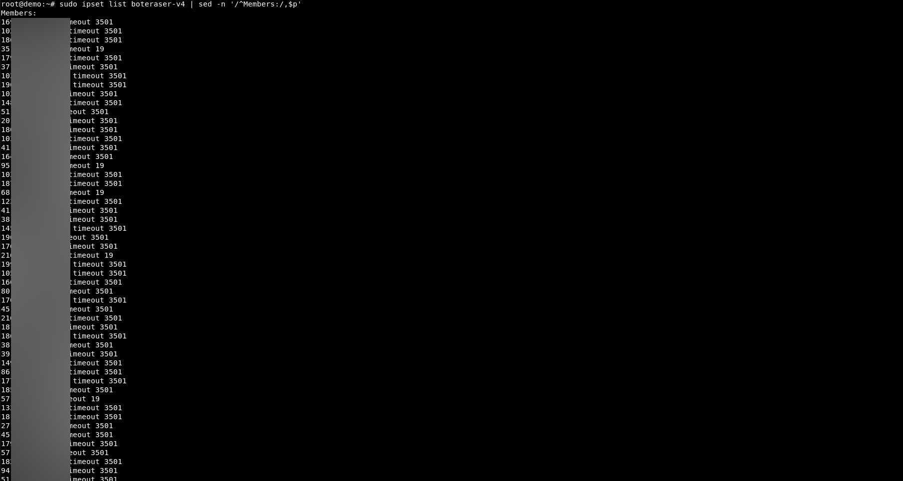
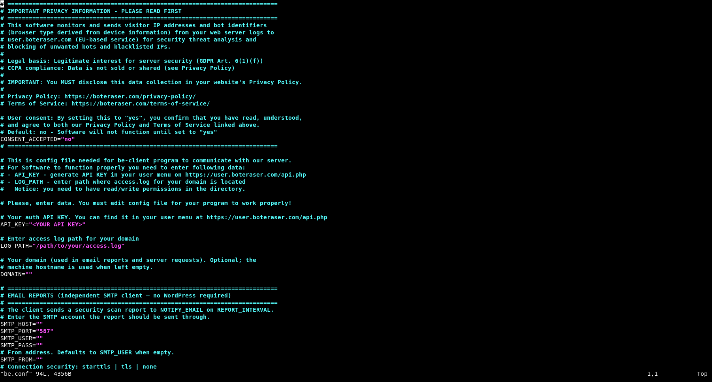

# BE Client (Manual VPS/Dedicated Install)

Short description: Self-hosted security client that runs on your own VPS or dedicated server. Choose this if you prefer full control and a manual setup. It runs as a background service (daemon) and protects your server continuously.

## Disclaimer
DISCLAIMER: This is powerful security software that runs with elevated privileges and modifies your system. It is provided "AS-IS" and "AS-AVAILABLE" without warranty of any kind, express or implied, including but not limited to the warranties of merchantability, fitness for a particular purpose, or non-infringement. Your use of the software is at your own risk. By downloading, installing or using this software, you agree to our [Terms of Service](https://boteraser.com/terms-of-service/) and [Privacy Policy](https://boteraser.com/privacy-policy/).

## What it does
Running as a single daemon it provides:
- **Threat-list blocking** — blocks unwanted IPs at the firewall (`iptables`/`ipset`) with tiered durations (blacklist 24h, rate-limited bots 1h, greylist 30min, whitelist bypass).
- **Brute-force protection** — blocks IPs with too many failed SSH logins.
- **Log-based WAF** — blocks IPs sending attack patterns (SQLi/XSS/RCE/LFI/RFI/scanner) found in the access log.
- **Country blocking** — blocks countries you selected in your dashboard.
- **Malware scanning** — cloud hash lookup (with quarantine) plus local signature scan for webshells/backdoors.
- **Vulnerability scan** — checks your server software versions (nginx/apache, PHP, OpenSSH, OS).
- **Email reports** — periodic HTML security report via its own SMTP client.
- Firewall blocks survive a reboot.

## When to use
- You need a manual install on your own server
- You want to customize each step
- Alternative (recommended): use the automated installer here: ../be-client-install-script/README.md

## Prerequisites
- Linux server (VPS or Dedicated)
- Shell access (bash) with sudo/root privileges
- `iptables` and `ipset` (the client auto-installs `ipset` if missing; `ip6tables` is optional for IPv6)
- `tar` installed (to extract the archive)
- Your API KEY — get it at https://user.boteraser.com/api.php
- Outbound HTTPS access to `user.boteraser.com`
- (Optional) An SMTP account if you want email reports

## Quick start

1. Download be-client-latest.tar.gz to /opt and extract it:

```bash
cd /opt
wget https://github.com/sofset-dev/boteraser/raw/refs/heads/main/be-client/be-client-latest.tar.gz
tar -xzvf be-client-latest.tar.gz
cd boteraser
```

This creates `/opt/boteraser` containing `be-client`, `be.conf` and `be-client.service`.

2. Edit the configuration file:

```bash
nano be.conf
```

At minimum set the following:

```
CONSENT_ACCEPTED="yes"
API_KEY="<YOUR API KEY>"
LOG_PATH="/var/log/nginx/access.log"
```

For email reports also set `SMTP_HOST`, `SMTP_USER`, `SMTP_PASS`, `NOTIFY_EMAIL`. Every option is documented with comments inside `be.conf`.

3. Install the systemd service:

```bash
sudo cp /opt/boteraser/be-client.service /etc/systemd/system/
sudo systemctl daemon-reload
```

> If you installed somewhere other than `/opt/boteraser`, edit `WorkingDirectory` and `ExecStart` in `/etc/systemd/system/be-client.service` first.

4. Start it and enable it on boot:

```bash
sudo systemctl enable --now be-client
```

5. Verify it is running:

```bash
sudo systemctl status be-client
sudo journalctl -u be-client -f
```

✅ That's it! BE Client now runs continuously in the background and protects your server automatically.

## Useful commands

```bash
sudo ipset list boteraser-v4     # show blocked IPv4 addresses
sudo systemctl restart be-client # restart the service
sudo systemctl stop be-client    # stop the service
sudo journalctl -u be-client -f  # follow the live log
```

## Run manually (optional)

```bash
sudo /opt/boteraser/be-client --scan-now    # run a malware + vulnerability scan and print results
sudo /opt/boteraser/be-client --report-now  # run a scan and send the email report now
```

## Notes
- Prefer the one‑command automated install? See: ../be-client-install-script/README.md

## Screenshots

Install the script with the automated installer or set it up manually—both provide the same monitoring functionality. Below are some example screenshots showing the BE Client in action:

### Script Analyzing and Blocking IPs
This script analyzes web server logs and blocks listed IPv4 and IPv6 addresses or CIDR ranges by adding firewall rules to help reduce unwanted traffic.



### Script CONFIG
Central configuration for the blocking script, specifying API credentials and path to your log file.


